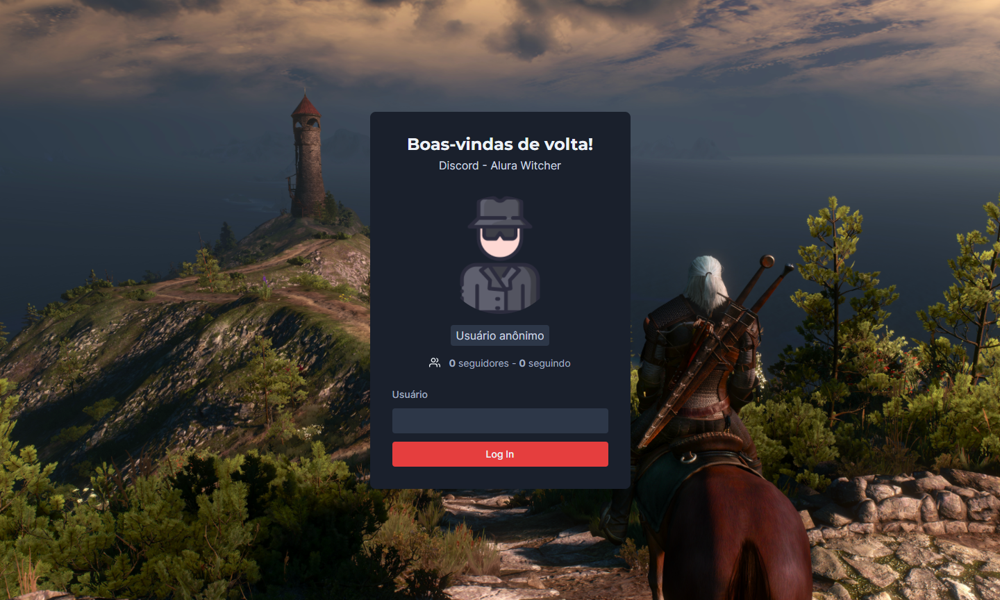
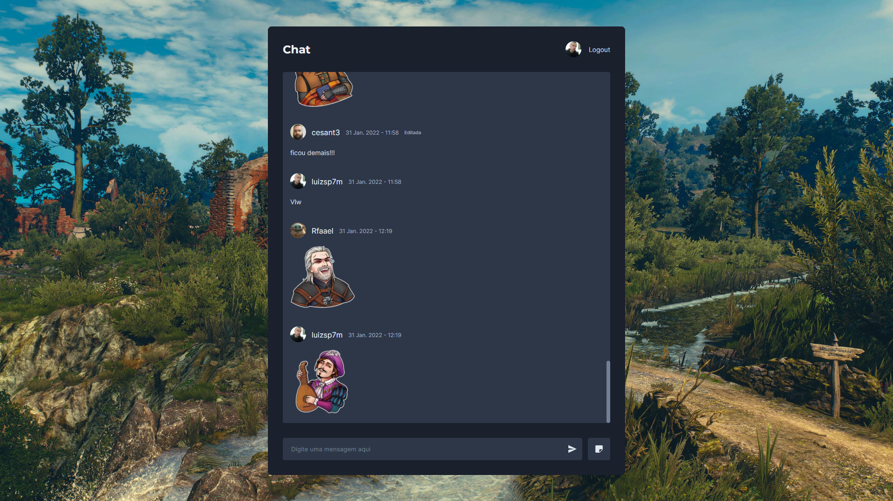

### Alura Witcher

Alura Witcher é tematizada no universo do jogo The Witcher 3 e é uma variação da aplicação que desenvolvemos durante a Imersão React da Alura.
Outras mudanças em relação a aplicação original são:
- SASS para os estilos
- Typescript
- Utilização da API do Github para verificar se um usuário existe ou não
- Prevenção de múltiplas requisições com Debounce
- Sessão do usuário salva no cookies
- Editar e apagar mensagens
- Loadings
- Sons

### Funcionalidades

- Log In com qualquer usuário do Github
- Enviar mensagens
- Enviar stickers
- Editar mensagem
- Excluir mensagens / stickers
- Chat em realtime
- Logout

#### Tecnologias:

- Next.js
- Typescript
- SCSS
- Supabase
