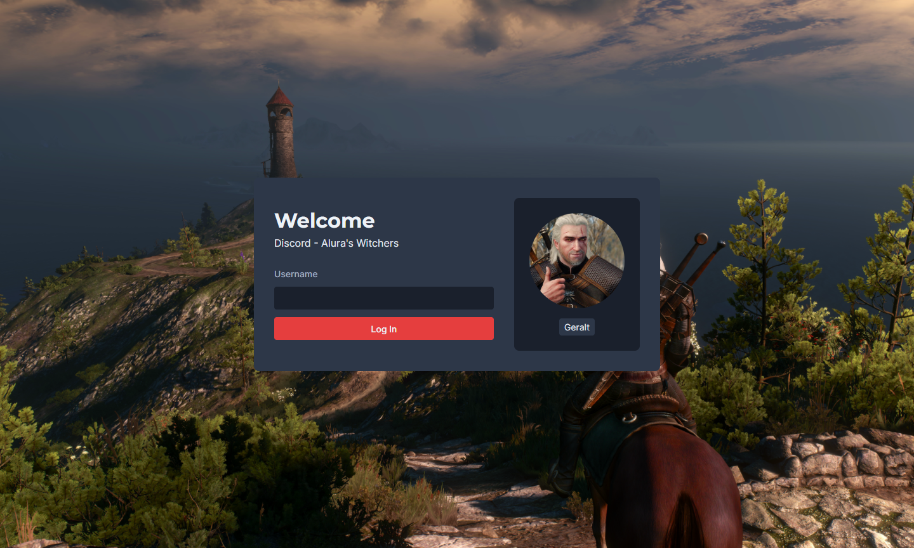

### Alura's Witchers 

Alura's Witchers é tematizada no universo do jogo The Witcher 3 e é uma variação da aplicação que estamos desenvolvendo durante a Imersão React da Alura.
Outras mudanças em relação a aplicação original são:
- SASS para os estilos
- Typescript
- Utilização da API do Github para verificar se um usuário existe ou não
- Prevenção de múltiplas requisições com Debounce

